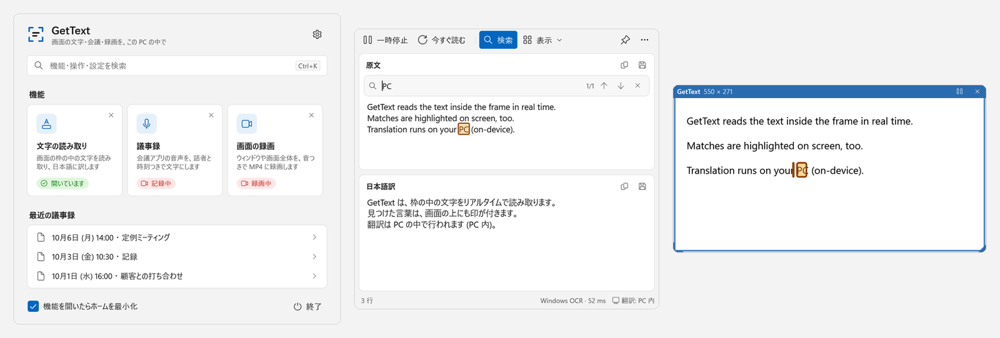
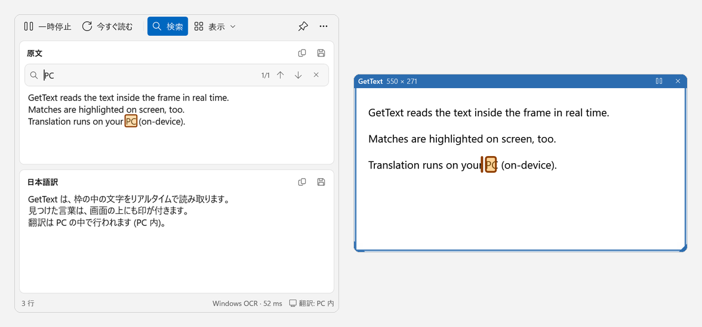
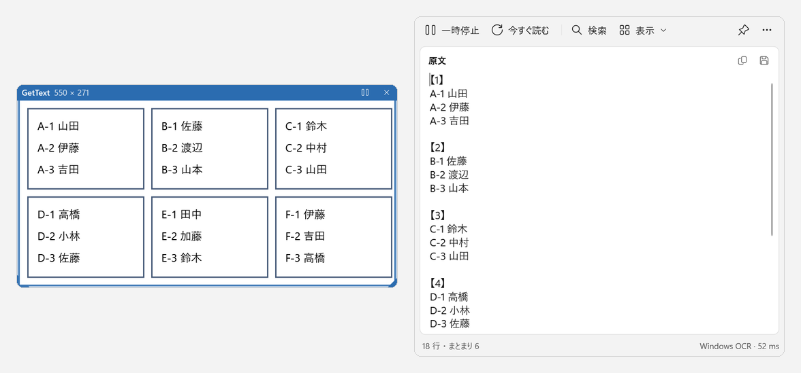
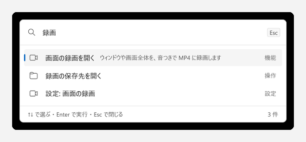
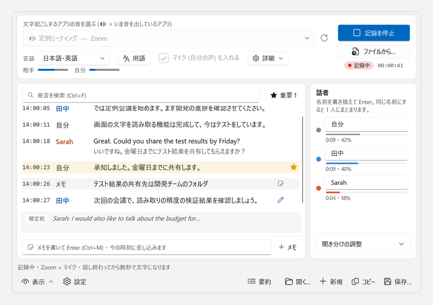
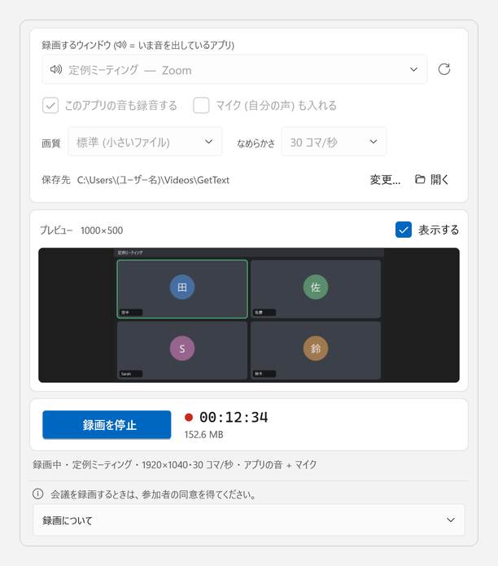
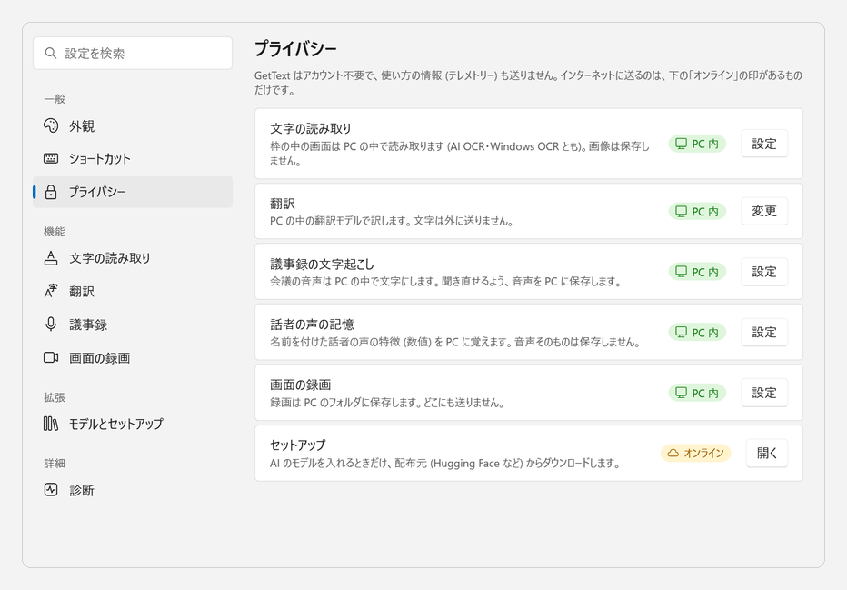
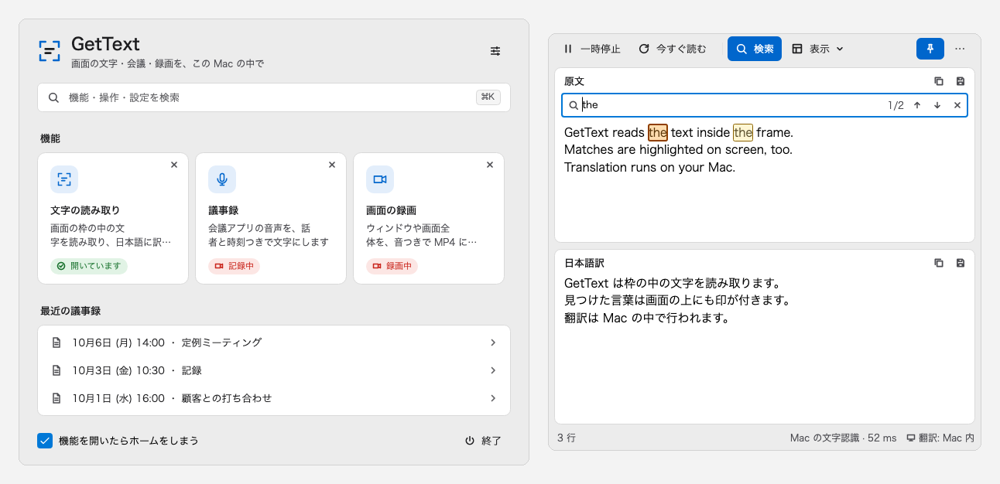

<p align="center"></p>
<h1 align="center">GetText</h1>
<p align="center"><b>Local-first screen intelligence for Windows &amp; macOS</b><br>画面の文字・会議・録画を、この PC の中で</p>

<p align="center"></p>

- **OCR anything.** 画面に置いた枠の中の文字を、リアルタイムに読み取ってテキストに (AI OCR / Windows OCR / Mac の文字認識)
- **Find it on screen.** Ctrl+F (⌘F) で探すと、読み取った文字と画面の上の両方に印が付く
- **Read by layout.** 名簿や表のように枠で区切られた文字を、枠ごとのまとまりで読む
- **Translate it live.** 外国語の文を日本語に (PC の中の翻訳モデル。Google・DeepL も選べる)
- **Transcribe meetings.** 会議の音声を、話者と時刻つきの議事録に (要約・字幕つきの動画も)
- **Record the screen.** 選んだウィンドウを、その音も入れて MP4 に

<p align="center">
<a href="https://github.com/KoroCoding/GetText/releases/latest"><b>Windows 版をダウンロード</b></a> ・
<a href="https://github.com/KoroCoding/GetText/releases/latest"><b>Mac 版をダウンロード</b></a>
<br>アカウント不要 ・ ローカルファースト (送るのは選んだときだけ) ・ オープンソース (GPL-3.0)
</p>
> **English summary**
>
> GetText is a free, open-source desktop app for Windows and macOS that (1) reads text on the screen inside a movable frame (OCR) and translates it into Japanese, (2) turns meeting audio into minutes with timestamps, speakers and summaries, and (3) records a selected window together with its audio. All processing — OCR, translation, speech recognition, summarization and recording — runs locally on the user's PC.
>
> - **Download:** [GitHub Releases](https://github.com/KoroCoding/GetText/releases) — `GetText-windows-x64.zip` (Windows 10 2004+ / 11, 64-bit) and `GetText-mac-arm64.zip` / `GetText-mac-x64.zip` (macOS). Unzip and run `setup.bat` (Windows); the setup downloads Python and the AI models.
> - **Code signing:** Free code signing provided by [SignPath.io](https://about.signpath.io/), certificate by [SignPath Foundation](https://signpath.org/) (applied for; releases before approval are unsigned). Only binaries built from this repository by GitHub Actions are signed. Committers, reviewers and approvers: [KoroCoding](https://github.com/KoroCoding).
> - **Privacy:** This program will not transfer any information to other networked systems unless specifically requested by the user or the person installing or operating it (optional online translation via Google or DeepL, and downloads during setup). No telemetry is collected.
> - **Uninstall:** run `uninstall.bat`, then delete the folder.
> - **License:** [GPL-3.0-or-later](LICENSE). AI models downloaded at setup keep their own licenses (see "ライセンス" below; the optional NLLB-200 model is CC BY-NC 4.0).

画面の上に中が透明な「読み取り枠」を出し、枠の中の文字をリアルタイムに読み取って、隣のウィンドウにテキストとして表示するアプリです。外国語の文は日本語訳も並べて表示します。会議などの音声を、時刻と話者つきの議事録にもできます。選んだウィンドウを、その音も入れて録画することもできます。Windows 版と Mac 版があります (Mac 版は「Mac で使う」を参照)。

起動すると **ホーム** が出ます。「文字の読み取り」「議事録」「画面の録画」のタイルを押すと開きます (いくつでも同時に開けます)。開いている機能のタイルには「開いています」「記録中」「録画中」が出て、押すと前に出し、右上の ✕ で閉じます。上の検索欄 (Ctrl+K) からは、機能・操作・設定・最近の議事録を探して実行できます。機能を開くとホームはタスクバーにしまわれ (チェックで変えられます)、機能をすべて閉じると戻ります。読み取り枠や文字の画面の ✕ は「文字の読み取りを閉じる」で、GetText は終わりません。
## できること

| | |
| --- | --- |
| **検索と画面の上の印** (Ctrl+F)<br>読み取った文字を探すと、原文の欄と読み取り枠の上の両方に印が付きます。今の一致は太い枠と左の印で示します。 |  |
| **まとまりごとに読む** (表示 → 枠・まとまりごと)<br>枠で区切られた名簿・表を、枠ごとに【1】【2】… の見出しを付けて並べます。枠が無ければ、横に並んだ列ごとに分けます。まとまりが無ければ上から順のまま。 |  |
| **コマンドの一覧** (Ctrl+K / ⌘K)<br>機能・操作・設定・最近の議事録を、日本語でも英語の名前でも探して、キーボードだけで実行できます。 |  |
| **議事録**<br>会議アプリの音声を、話者と時刻つきで文字にします。重要な発言の ★・メモ・要約・Word / 字幕の書き出し。 |  |
| **画面の録画**<br>選んだウィンドウ (または画面全体) を、その音も入れて MP4 に録画します。 |  |
| **プライバシーが見える**<br>設定 → プライバシー で、何を PC の中で処理し、何をインターネットに送るか (「PC 内」「オンライン」の印) を確かめられます。 |  |
| **Mac 版**<br>同じ機能を、Mac の見た目と操作 (⌘ のキー・メニューバー) で使えます。 |  |

デザインの決まり (色・文字・アイコン・部品・拡張機能の登録): [docs/design/DESIGN.md](docs/design/DESIGN.md)
## 別の PC で使う (セットアップ)

紹介と使い方の動画: [docs/GetText_紹介と使い方.mp4](docs/GetText_紹介と使い方.mp4) (約 9 分・ナレーション付き。入れ方・ホーム (旧: 機能を選ぶ画面)・文字の読み取り・議事録 (録画と字幕つきの動画も)・画面の録画・設定。音声: VOICEVOX:No.7)

1. GitHub からこのリポジトリを取得する (`git clone`、または GitHub の Code → Download ZIP で取得して展開)
2. `GetText` フォルダの **`setup.bat` をダブルクリック**する (エクスプローラーから実行してください)
3. 入れる機能を選ぶ (この PC に合う番号を「おすすめ」として出します。NVIDIA の GPU とメモリ 16GB 以上ならフル、メモリ 8GB 以上なら標準。Enter だけでおすすめになります)

   | 番号 | 機能 | ダウンロード |
   | --- | --- | --- |
   | 1. フル | 文字の読み取り・英語の翻訳・議事録 (文脈による聞き間違いの補正・要約まで) | 約 8GB |
   | 2. 標準 | 1 から「文脈による聞き間違いの補正」と「要約」を除く | 約 4GB |
   | 3. 最小 | 文字の読み取りと英語の翻訳だけ (議事録なし) | 約 1GB |

   英語以外の言語 (中国語・韓国語など約 200 言語) の翻訳モデル [NLLB-200](https://huggingface.co/OpenNMT/nllb-200-distilled-1.3B-ct2-int8) (約 1.4GB) は、ライセンスが CC BY-NC 4.0 (非商用のみ) なので、入れるかを聞きます (既定は入れない。`setup.bat -WithNllb` で入れる)。入れないときは、英語以外の文字には日本語訳を付けません (翻訳を Google・DeepL にすれば訳せます)。

4. 終わるとデスクトップとスタートメニューに「GetText」ができる

**ビルド済みの配布版** (GitHub の [Releases](../../releases) の `GetText-windows-x64.zip`、約 80MB): 展開して `GetText` フォルダの `setup.bat` を実行するだけです。アプリに .NET が入っているので、.NET SDK のインストールとビルドを省き、Python と AI のモデルだけを用意します。配布版は `tools\make_release.ps1 -Out GetText_配布版.zip` で作れます。
- 配布版の更新: GetText を終了し、使っている GetText のフォルダーを消してから、新しい `GetText_配布版.zip` を展開して `setup.bat` を実行します。AI の環境とモデル (`%LOCALAPPDATA%\GetText\offline`)・議事録 (`%LOCALAPPDATA%\GetText\minutes`)・設定 (`%APPDATA%\GetText`) はフォルダーの外にあるので、そのまま使えます (入っている部品はダウンロードし直しません。機能の選択は前と同じものを選んでください)。ショートカットも新しい場所に作り直します。
  - 同じ場所に置き換えるだけなら、新しい ZIP の中の `update.bat` でもできます (元のフォルダの控え `GetText.bak` を取り、途中で失敗したら元に戻します)。
- GetText の中からも、設定 → モデルとセットアップ → 「セットアップを実行」で、入れる機能をおすすめ付きで選んでセットアップできます (セットアップの間は GetText を閉じます)。AI の機能が入っていないときは、メイン画面の上に案内が出ます。

`setup.bat` がすること:
- .NET 9 SDK と Python 3.11 が無ければ **winget** でインストールする (それぞれの利用条件に同意したことになるので、実行前に確認を求めます)
- GetText をビルドする (`bin\Release\...\GetText.exe`)
- AI 機能の Python 環境 (`%LOCALAPPDATA%\GetText\offline`) を作り、モデルをダウンロードする (`offline\setup_offline.ps1`)
- NVIDIA の GPU があるのに CUDA Toolkit が無い PC には、GPU 用の cuBLAS (pip 版、約 0.6GB) を入れる。GPU が無い PC でも、議事録は速い音声認識 (軽さ優先) で記録に遅れずに文字にできます
- ダウンロードの前にディスクの空きを確かめる (足りなければ始めずに知らせる)
- 番号や Y/n は、日本語入力がオンのままの全角 (「１」「ｙ」) でも受け付け、違う入力は聞き直す
- 記録を `setup.log` に残す。途中で止まっても、もう一度実行すれば済んだ分は飛ばします

条件と注意:
- Windows 10 バージョン 2004 以降 / Windows 11 の 64 ビット版。議事録で「ウィンドウを選んで音声を取り込む」には Windows 11 が必要です (マイクとファイルからの文字起こしは Windows 10 でも使えます)
- **Smart App Control** が有効な PC では、GetText (自分でビルドしたものも配布版も、署名のない新しいファイル) が起動をブロックされることがあります (起動しない / 「アプリケーション制御ポリシーによってブロック」)。その場合は Windows セキュリティ → アプリとブラウザー コントロール → スマート アプリ コントロール を確認してください (オフにすると、Windows を入れ直すまで再びオンにはできません)
- 紹介と使い方の動画は `tools\make_video.py` で作り直せます (`GetText.exe --doc-snapshots <フォルダ>` で見本のデータの画面を画像にし、字幕とナレーションを付けて MP4 にする。画面の外で描くので、実際の画面は映りません)。ナレーションは、[VOICEVOX ENGINE](https://github.com/VOICEVOX/voicevox_engine/releases) の CPU 版 (約 1.8GB) を `tools\voicevox` に展開してあれば VOICEVOX の自然な声 (PC 内で合成、`tools\voicevox_tts.py`) で、無ければ Windows の日本語音声で読みます。VOICEVOX を使った動画には「VOICEVOX:キャラクター名」の表記が必要です (動画の最後に入れています)。声は環境変数 `GETTEXT_VOICE` (例: `No.7/読み聞かせ`、`青山龍星/ノーマル`) で変えられ、話す速さ・抑揚・読点の間は `tools\voicevox_tts.py` の `SPEED`・`INTONATION`・`PAUSE` で調整できます。ナレーションは文ごとに読み、文の長さに合わせた間をあけ、文ごとに速さ・高さ・抑揚をごくわずかに変え、声の大きさをそろえて、機械的に聞こえないようにしています

## Mac で使う (Mac 版)

Mac 版 (`mac` フォルダー) は、議事録・読み取り枠・原文と日本語訳・設定を Windows 版と同じ働きで使えるアプリです (画面は Avalonia、Mac の機能は Swift の補助プログラム)。文字起こし・話者の聞き分け・要約・翻訳は Windows 版と同じ Python の処理を Mac の中で動かします。

1. ZIP を展開して、`GetText.app` を「アプリケーション」フォルダーに入れる
   - Apple シリコン (M1 以降) の Mac: `GetText-mac-arm64.zip` ・ Intel の Mac: `GetText-mac-x64.zip`
2. 初めて開くとき: 署名 (Apple の公証) のないアプリなので、そのままでは開けません。GetText.app を開こうとしたあと、**システム設定 → プライバシーとセキュリティ** の下の方の「"GetText" は開発元を確認できないため…」の横の **「このまま開く」** を押します (ターミナルで `xattr -dr com.apple.quarantine /Applications/GetText.app` を実行してもかまいません)
3. 許可: 画面の文字の読み取りと、アプリの音の取り込みには **「画面収録とシステムオーディオ録音」**、議事録で自分の声を入れるには **「マイク」** の許可が要ります (初めて使うときに聞かれます。後からは システム設定 → プライバシーとセキュリティ で GetText をオンにして、GetText を開き直します。新しい版の GetText.app に入れ替えたあとは、署名が変わるため許可をもう一度求められることがあります。その一覧に古い GetText が残っていたら、「−」で消してから許可し直してください)
4. 議事録・AI の文字認識・ローカル翻訳を使うには、GetText の **設定 → モデルとセットアップ → 「セットアップを実行」** を押す。ターミナルが開き、Python 3.11 の環境と AI のモデル (フル 約 8GB) を `~/Library/Application Support/GetText/offline` に用意します。Python 3.11 が無いときは入れ方を案内します ([python.org](https://www.python.org/downloads/macos/) の installer か、Homebrew の `brew install python@3.11`)

Windows 版との違い:
- 条件は macOS 14 (Sonoma) 以降。文字の読み取りは追加のインストール不要の **Mac の文字認識 (Vision)** を使います (日本語・英語・中国語・韓国語)。AI の文字認識 (PP-OCRv6) もセットアップすれば選べます
- 議事録の音は、選んだアプリ (会議アプリ・ブラウザなど) だけ、または「すべての音 (GetText 以外)」を ScreenCaptureKit で取り込みます。🔊 (音を出しているアプリ) の印は macOS 14.4 以降で付きます
- どのアプリを使っていても効くキーは **⌃⌥C / ⌃⌥T / ⌃⌥R / ⌃⌥P** (コピー・訳のコピー・今すぐ読取・一時停止)、画面の中のキーは Ctrl の代わりに **⌘** (⌘F 検索・⌘S 保存・⌘B ★ など)
- 記録や要約の途中で GetText を終了 (⌘Q) したり、文字の画面を閉じたりすると、止めて保存するかを確かめます
- 画面の録画は ScreenCaptureKit で取り込み、MP4 (H.264 + AAC) に書き出します (保存先は既定で `ムービー/GetText`)。Mac 版ではマイクの音は入れられません (アプリの音・画面全体の音は入ります)。議事録の「会議の画面も録画する」「字幕つきの動画も作る」も使えます (録画にマイクの声は入りません。字幕の焼き込みは VideoToolbox で書き出します)。初めて使うときは「画面収録とシステムオーディオ録音」の許可が要ります
- ホームは、メニューの「GetText → 機能を選ぶ画面」(⌘0) でいつでも出せます。コマンドの一覧は ⌘K
- DeepL のキーは Mac のキーチェーンに保存します。設定・議事録・ログは `~/Library/Application Support/GetText` に置きます
- NVIDIA の GPU は使えないので、文字起こしと AI は CPU で動きます (Apple シリコンなら会議の長さと同じくらいの時間で文字になります。Intel の Mac では時間がかかります)

確かめたこと (GitHub の Mac・macOS 15): GetText.app のビルド (Apple シリコン・Intel)、補助プログラム (Vision の文字認識・キーチェーン・ショートカット・画面と音の取り込み)、議事録の画面の操作 (28 項目)、実際の画面での起動と枠の中の取り込み (文字の読み取り自体は補助プログラムの確認で、描いた日本語と英語を読めることを確認)、Intel 版の起動 (Rosetta)、議事録の通しの確認 (架空の会議で文字の誤り率 1.6%・話者の聞き分け 100%)、実際に再生した音を取り込んで議事録にする確認 (誤り率 1.6%)。会議アプリ (Zoom・Teams など) での実際の通話と、マイクの音は確かめていません。

作り方 (Mac で): `bash mac/packaging/build_app.sh <出力フォルダ> [arm64|x64]` (Xcode のコマンドラインツールと .NET 9 SDK が必要)。GitHub に push すると、`.github/workflows/mac.yml` が GitHub の Mac で GetText.app を作り、補助プログラム・画面の操作・実際の画面での起動を確かめて、結果と ZIP を `ci/mac-results` ブランチに置きます (手動で実行して「full」をオンにすると、議事録の通しの確認もします)。

## 必要なもの

- Windows 10 2004 以降 / Windows 11
- .NET 9 SDK（ビルド用）
- OCR 言語パック（日本語なら「設定 > 時刻と言語 > 言語と地域 > 日本語 > 言語のオプション > 光学式文字認識」）
  - 英語の画面を読むことが多いなら英語の OCR も入れると精度が上がります（言語に「自動 (日本語+英語)」が出ます）。管理者の PowerShell で:
    `Add-WindowsCapability -Online -Name "Language.OCR~~~en-US~0.0.1.0"`

## 起動

> **セットアップ (`setup.bat`) はエクスプローラーからダブルクリックするか、GetText の 設定 → モデルとセットアップ → 「セットアップを実行」で行ってください。** ストアアプリなど別のアプリの中から実行すると、Windows の仕組みでファイルがそのアプリ専用の場所に入り、GetText から見えないことがあります。

```bash
dotnet run -c Release
```

または `start.bat` をダブルクリックします。

## 使い方

| 操作 | 内容 |
| --- | --- |
| 枠の青いバーをドラッグ | 枠を移動 |
| 枠の縁・角をドラッグ | 枠のサイズを変更 |
| 枠の中 | 透明でクリックも下のウィンドウに抜けるので、スクロールなどもそのままできる |
| 一時停止 / 再開 | 自動読み取りの一時停止 / 再開（Ctrl+P）。停止中は枠がオレンジ色になり、バーに「停止中」と出る |
| 今すぐ読む | 1 回だけ読み取る（F5）。停止中でも使える |
| 検索（Ctrl+F） | 読み取った文字を探す。見つかった所は原文の欄と読み取り枠の上に印が付く（今の一致は太い枠と左の印）。Enter / F3 で次、Shift+Enter で前、Esc で閉じる |
| 表示 ▾ | 並べ方（上から順 / 枠・まとまりごと）・日本語訳の位置（下 / 右）・蓄積（スクロールしながら読んだ内容を重複なしでつなげる。帯の「クリア」「終える」で操作） |
| ピン | 常に手前に表示 |
| その他（…） | 原文・日本語訳をファイルに保存、議事録、コマンドの一覧（Ctrl+K）、設定（Ctrl+,） |
| 欄の右上のアイコン | コピー（選択範囲があればその部分、なければ全文。Ctrl+Shift+C / Ctrl+Shift+T）/ ファイルに保存 |
| 欄の右クリック | コピー・すべて選択・全文をコピー・保存・文字変換 |
| Ctrl+ホイール | 文字サイズの拡大 / 縮小 |
| Ctrl+K | コマンドの一覧（どの画面からでも。機能・操作・設定・最近の議事録を探して実行） |

窓が狭いときは、操作バーの文字を隠してアイコンだけにします（名前はマウスを乗せると出ます）。下の右には、読み取りの方式と時間（例: 「AI OCR · 48 ms」。詳しくはマウスを乗せると出る）と、翻訳の場所（「PC 内」/「オンライン」）を出します。AI OCR の準備中や、使えずに Windows OCR で読んでいるときは、欄の上の帯で知らせます（読み取りは止まりません）。

見た目は Windows 11 風（Fluent 2）で、ライト / ダーク / Windows の設定に合わせる を選べます（設定 → 外観）。設定は「一般（外観・ショートカット・プライバシー）」「機能（文字の読み取り・翻訳・議事録・画面の録画）」「拡張（モデルとセットアップ）」「詳細（診断）」に分かれ、左上の検索で項目を探せます（Ctrl+F）。

どのアプリを操作中でも使えるホットキー:

| キー | 内容 |
| --- | --- |
| Ctrl+Alt+C | 認識テキストをコピー |
| Ctrl+Alt+T | 日本語訳をコピー |
| Ctrl+Alt+R | 今すぐ読み取る |
| Ctrl+Alt+P | 一時停止 / 再開 |

これらのキーは 設定 → ショートカット の「変更…」で変えられます (Ctrl か Alt と一緒のキー。ほかのアプリが使っていて使えないときも、そこで別のキーにできます。Alt+F4・Alt+Tab・Ctrl+Esc など Windows で決まった働きのあるキーは選べません)。起動時に使えないキーがあったときは、文字の画面の上に知らせが出て、そこから設定を開けます。各ボタンの説明 (マウスを乗せたとき) には、今のキーを表示します。

- 文字の画面は読み取り枠の右隣について行きます (設定 → 文字の読み取り)。画面の端で右に入らないときは左・下・上に回り、画面の外には出ません。
- テキストを選択している間は表示を書き換えず、選択を解除すると最新の結果が反映されます。
- 画面に変化がないとき（文字入力カーソルの点滅など小さな変化だけのときも）は OCR も翻訳も行いません。
- 蓄積モードでは、枠の上下の端で切れている行は読み間違いが多いので取り込みません。重なる部分がないほど大きく移動した場合は、段落を分けて後ろに追記します。

### OCR エンジン

| エンジン | 内容 |
| --- | --- |
| **AI (PP-OCRv6・高精度)**（既定） | [RapidOCR](https://github.com/RapidAI/RapidOCR) + PaddleOCR の PP-OCRv6 small（Apache-2.0）。日本語・英語・中国語などを 1 つのモデルで読み、記号（「」：・→ など）や表の短いセルも正確。GPU（DirectML）で 1 回 約 0.1〜0.25 秒（GPU がなければ CPU で 約 0.1〜0.7 秒）。`setup.bat` (またはアプリの 設定 → モデルとセットアップ →「セットアップを実行」) でインストール。使えないときは自動で Windows OCR に切り替わる |
| **Windows (軽量)** | Windows 標準 OCR。追加のインストール不要で速いが、記号や離れた短い単語を誤りやすい |

同じ合成画像 408 枚での文字誤り率:

| | 全体 | 11px 以上 | 9px | 実画面のスクリーンショット |
| --- | --- | --- | --- | --- |
| Windows OCR（下記の高精度モード） | 15.04% | 6.5% | 58% | 8.4% |
| AI (PP-OCRv6 small) | **1.28%** | **0.5%** | **5.4%** | **1.1%** |

AI OCR では、表のように同じ高さで分かれて検出された断片を 1 行にまとめます（例: 「関東」+「：直流」→「関東：直流」）。

**小さい・ぼやけた文字の読み直し**: 読み取りの確からしさが低いとき (動画の中の小さな資料の画像など)、画面が止まったら高精度の認識モデル (PP-OCRv6 rec medium、Apache-2.0、約 77MB) で 1 回だけ読み直します。普段の読み取りは速いモデルのままです。かなを含む行では、日本語で使わない漢字 (簡体字) を候補から外し、ぼやけた字が形の似た簡体字に読まれるのを防ぎます (中国語の行はそのまま)。
- 会議の録画の背景に写った、文字の高さ 12px ほどのぼやけた次第の画像で、誤り率 29.8% → 25.3% (GPU で約 1 秒、CPU では約 10 秒)。
- 試して効かなかったもの: 機械学習の超解像 (Real-ESRGAN。ぼやけた漢字を塗りつぶして 77% に悪化)、PP-OCRv5 server (51.5%)、manga-ocr (94.4%)、複数のフレームの多数決、補正の AI による文脈からの修正 (32.3%)。元の画像に字の形が残っていないところは、どの方法でも戻せませんでした。

### Windows OCR の高精度モード（既定でオン）

- 暗い背景（ダークモード）を自動で反転、グレースケール化、余白の追加、高品質（バイキュービック）拡大、軽いシャープ化
- 文字の大きさを測って最適な倍率（1 行 約 40px）で読み直す自動拡大
- 3 種類の倍率で読み、行ごとに多数決
- 前後の文字からの補正（例: 「バ一ジョン」→「バージョン」、「こャー」→「ニャー」、文末の「0」→「。」）

合成画像 408 枚（4 フォント系統 × 9〜28px × ライト/ダーク/グレー/青背景）での文字誤り率:

| 方式 | 全体 | 11px 以上 |
| --- | --- | --- |
| 単純な 2 倍拡大 | 18.98% | 9.6% |
| 高精度モード | 15.04% | 6.5% |

9px 以下の極小文字は Windows OCR の限界で、どの前処理でもほとんど改善しません。枠の中を拡大表示（Ctrl+ホイールなど）してから読むのが確実です。

### 日本語訳

- 「日本語訳を表示」をオンにすると、**外国語と判定した文だけ**を翻訳サービスに送信し、日本語訳を表示します（日本語の行はそのまま）。
- 行の途中で折り返された文は 1 文につなげてから翻訳します。
- 翻訳済みの文はキャッシュされ、画面が変わった部分だけを送信します。
- 翻訳エンジン
  - **ローカル (オフライン・無制限)**（既定）: PC 内の翻訳モデルで翻訳します。回数制限・料金なし、文字を外部に送りません。
    - 英語 → [FuguMT](https://huggingface.co/staka/fugumt-en-ja)（CC BY-SA 4.0）、その他約 200 言語 → [NLLB-200 1.3B](https://huggingface.co/OpenNMT/nllb-200-distilled-1.3B-ct2-int8)（CC BY-NC 4.0・非商用。セットアップで選んだときだけ入ります）
    - [CTranslate2](https://github.com/OpenNMT/CTranslate2) で動作。NVIDIA GPU があれば自動で使用（RTX 4070 Laptop で英語 1 文 約 80〜130 ms、その他 約 300〜400 ms）
    - 初回だけ `setup.bat` (またはアプリの 設定 → モデルとセットアップ →「セットアップを実行」) で AI の機能を入れてください（Python 3.11 が必要。モデルは `%LOCALAPPDATA%\GetText\offline` にダウンロードし、SHA-256 で検証します。「2. 標準」はダウンロード約 4GB、読み取りと英語の翻訳だけの「3. 最小」は約 1GB）
  - **Google (キー不要)**: 設定不要。ただし非公式の無料エンドポイントのため、短時間に大量に送ると一時的に制限されます（アプリ側で送信を 1 本ずつ・約 1 秒間隔に抑え、制限時は予備のエンドポイントへ切り替え、それも駄目なら 1 分待って再試行します）。
  - **DeepL (API キー)**: [DeepL API Free](https://www.deepl.com/pro-api)（月 50 万文字まで無料）のキーを「キー設定…」から入力します。安定していて訳の品質も高いです。キーは Windows の DPAPI で暗号化して保存されます。
- Google / DeepL では読み取った文字が外部に送られるため、機密情報を表示するときはローカルを使うか翻訳をオフにしてください。

### 議事録 (ウィンドウの音声の文字起こし)

メイン画面の「議事録」から開きます。

1. 会議アプリ (Zoom / Teams / ブラウザなど) のウィンドウを選ぶ。いま音を出しているウィンドウには 🔊 が付き、一覧の先頭に並んで自動で選ばれます。どのアプリか分からないときは「すべての音 (GetText 以外)」を選びます。ストアアプリ (Skype・電話リンクなど) も、窓を選べばそのアプリの音を取り込みます。選んだウィンドウから 8 秒音が来ないときは、いま音を出しているアプリの名前を添えて選び直しを案内します
2. 「言語」で文字にする言語を選ぶ (既定は日本語と英語)。自分の声も入れるときは「マイク (自分の声) も入れる」をオンにする (既定でオン)
3. 「記録を開始」を押す → ボタンの下の印が「記録中」になり、話している途中から一覧の下に灰色で文字が出て (約 0.7 秒ごとに更新)、話し終わると約 1 秒で時刻・話者つきの発言として確定する
4. あまり変えない設定は「⚙ 詳細」にまとめてあります (速さ・文脈による補正・音声の保存・読み取り画面を隠す)。表示の切り替え (自動スクロール・時刻・日本語訳・相づち) は左下の「表示」にあります
5. 議事録だけを使うときは「⚙ 詳細」→「議事録を開いている間、読み取りの画面を隠す」をオンにすると、読み取り枠と文字の画面を隠して読み取りも止めます (議事録を閉じると元に戻ります。設定は次回も引き継がれます)

**録画・録音済みのファイルから作る**: 「ファイルから…」で MP4 / MOV / MKV / WEBM などの動画や、MP3 / M4A / WAV / FLAC などの音声を選ぶと、録音と同じ処理 (区切り → 文字 → 話者の聞き分け → 補正) で議事録にします。時刻はファイルの先頭からの時間 (例: `12:34`、1 時間を超えると `1:02:03`) で示し、進み具合と残り時間を表示します。「中止」を押すとそこまでの発言を残して止めます。

- **用語** (言語の右のボタン): 会議に出てくる人名・社名・製品名・専門用語を 1 行に 1 つ登録します。音声認識がひらがなや別の漢字で書いても、**読みが同じなら登録した表記に直し**ます (例: しののめ → 東雲、高取 → 鷹取、ヒーラギホール → 柊ホール)。文脈による補正・要約・AI の訳でもこの表記を使います。
  - 読みが分かりにくい語は「九条(くじょう)」のように読みを添えます。決まった直し方は「誤り→正しい」(例: 車内→社内) で書けます。
  - 読みは [Janome](https://github.com/mocobeta/janome) (Apache-2.0) で調べます。テスト (珍しい固有名詞 7 語) では、正しく書けた語が 2 → 6 語に増えました。読みの違う語に聞き間違えたとき (九条 → 特上 など) は直せないので、「誤り→正しい」で登録してください。
  - 日本語の音声認識 (kotoba-whisper) は認識のときに用語を渡してもほとんど変わらなかったため、文字にした後で直します。英語などの音声認識には用語を渡します。
- **言語**: 「言語」のボタンを押して、文字にする言語にチェックを付けます (日本語・英語・中国語・韓国語・スペイン語・フランス語・ドイツ語など 15 言語)。
  - 1 つだけ選ぶと、その言語として文字にします。複数選ぶと、発言ごとにその中から判定します (既定は日本語と英語)。選んでいない言語にはならないので、日本語の発言が韓国語などと取り違えられることはありません。日本語だけの会議なら日本語だけにするのが確実です。
  - 日本語は日本語向けの kotoba-whisper、それ以外は [Whisper large-v3 turbo](https://huggingface.co/deepdml/faster-whisper-large-v3-turbo-ct2) (OpenAI Whisper の CTranslate2 版、MIT) で文字にします。1 秒に満たない発言 (「はい」など) や判定がはっきりしない発言は、その直前に話された言語とみなします (「Thank you.」などの英語にされないように)。記録中に変えると次の発言から反映されます。
  - 日本語以外の音声認識モデル (約 1.6GB) は、日本語以外を選んだときに初めて読み込みます。文脈による聞き間違いの補正は日本語の発言だけに行います。
  - 「日本語」だけのまま英語などが続けて話されると、言語の選び直しを案内します (日本語向けのモデルは英語をカタカナの日本語として書いてしまうため)。
  - 相づちの判定は英語の「Yeah」「I see」「Uh-huh」「Got it」なども対象です。
- **日本語訳** (既定でオン): 英語など日本語以外の発言には、原文の下に日本語訳を付けます。コピー・保存でも原文とセットで書き出します (テキストは原文の次の行に「(訳) …」、Markdown は「> 訳: …」)。翻訳は「翻訳」タブの設定にかかわらず PC 内のモデル (英語は FuguMT、それ以外は NLLB-200) で行い、会議の内容を外部に送りません。本文を書き直したり自動で補正されたりすると訳し直します。
- 選んだウィンドウから 8 秒以上音が来ないときは、選び直しを案内します。「相手」「自分」の音量バーでも取り込めているか確認できます。
- 一覧はアプリ単位です。LINE の通話画面 (LineCall) のように子プロセスで開くウィンドウは親のアプリにまとまり、音声も子プロセスの分まで取り込みます。
- マイクは Windows の「既定の通信デバイス」(通話アプリが使うマイク) を使います。会議アプリで別のマイク (ヘッドセットなど) を使っているときは「⚙ 詳細」→「マイク」で選べます。マイクから 30 秒音が来ないときは知らせます。
- 雑音や無音から音声認識が作ってしまう文 (「ご視聴ありがとうございました」など) は取り除きます。
- PC の負荷が高くて処理が遅れると、画面の下に遅れの秒数を表示し、話し中の表示を省いて追いつきます。GPU のメモリを使い切らないよう、文脈補正の AI は必要になったときに読み込み、GPU に十分な空きがなければ CPU で動かします (補正が出るまで 5〜8 秒)。
- 動作の記録 (取り込めた音声の長さ・処理時間・遅れ。話した内容は含まない) を `%LOCALAPPDATA%\GetText\logs\minutes.log` に残します。

- **選んだアプリの音だけ**を取り込みます (Windows 11 のプロセス単位の音声キャプチャ)。他のアプリの通知音などは入りません。
- 音声認識は [kotoba-whisper v2.0](https://huggingface.co/kotoba-tech/kotoba-whisper-v2.0-faster) (日本語特化、MIT)、無音で発言を区切るのは Silero VAD、話者の聞き分けは [3D-Speaker CAM++](https://github.com/modelscope/3D-Speaker) (Apache-2.0)。すべて PC 内で処理し (RTX 4070 では GPU)、音声は外部に送りません。
- ウィンドウの音声は声の特徴で「話者1」「話者2」…に分け、マイクの発言は「自分」になります。右の欄で名前を書き換えて **Enter** を押すと、すぐにすべての発言に反映されます (Esc で取り消し)。同じ人が複数に分かれるときは、話者の欄の下の「聞き分けの調整」を開いて「声の聞き分けの細かさ」を左へ、別の人が同じ話者にまとめられるときは右へ動かします (記録済みの発言にもすぐ反映されます)。1 つの発言の話者が違うときは、右クリック → 話者を変更 で直せます。**同じ人が 2 人に分かれたときは、2 人に同じ名前を付けると 1 人にまとまり**、以後の分け直しでも 1 人として扱います (まとめると元に戻せないので、まとめる前に確かめます)。
- 話者の聞き分けは、発言を 1.5 秒ずつの窓に分けて声の特徴を取り、記録済みの全体をまとめて分け直します (序盤で間違えた話者もあとから付け直されます)。
  - 実際の人の声は、同じ人でも 1.5 秒ずつの特徴どうしがあまり似ておらず (類似度 0.3〜0.5)、別の人との差が小さいので、「この値以上なら同じ人」という固定の基準では同じ人が何人にも分かれてしまいます。そこで、似た窓どうしのつながりから人数を自動で推定する **スペクトラルクラスタリング (NME-SC)** で分け、あまり話さない人が埋もれていないかを調べて取り出し、最後に声の平均 (重心) どうしがよく似たまとまりをまとめます。重心どうしなら、同じ人は 0.8 以上、別の人は 0.5 前後以下とはっきり分かれます。
  - 窓が 8 個 (約 6 秒) に満たないまとまりは、最も近い人に入れます。声が 12 秒ほど集まるまでは 1 人とみなし、そのあと分け直します。
  - 会議アプリの回線や部屋の響きが全員に共通だと、別の人どうしも似て聞こえて 1 人と推定されやすいので、1 人と推定したときも 2 つに分けてみて、はっきり違えば 2 人とします。
  - 迷うときは分ける側に倒します。同じ人が 2 人に分かれても名前をそろえれば直せますが、別の人が 1 人にまとめられると発言ごとに直す必要があるためです。
  - 動作の記録 (`minutes.log`) に、分け直しのたびの窓の数・推定した人数・重心どうしの類似度を残します (話した内容は含みません)。うまく分かれないときの調整に使います。
  - 1 つの発言の途中で、2 窓 (約 2 秒) 以上続けて別の人の声になったら、そこで発言を分けてから文字にします。
  - 分け直しで話者を付け直すのは、直近の約 5 分の発言だけです。それより前の発言の話者は変えません。長い会議では、分け直すたびに推定した人数が揺れ、30 分前の発言が急に別の人にまとめられたり分かれたりしていたためです ただし会議の最初の約 15 分は、声が少なく人数を多めに分けてしまうので、固定せずに全体を分け直します (3 時間の会議の録画で、5 分以上前の発言の付け直しが 1,122 回 → 111 回 (ほとんどが最初の 15 分の中) に減り、正しさは同程度)。
  - 評価 (実際の英語の会議音声 [AMI コーパス](https://groups.inf.ed.ac.uk/ami/corpus/) の 4 人の会議 2 本、各 25〜30 分、記録中と同じように少しずつ流して最後の結果で採点): 1 人だけが話している時間のうち正しい話者になった割合は **90%** (以前の方式は 43%)、見つけた話者は 5 人と 3 人でした (以前は 104 人と 42 人)。話者ごとの正解率の平均は 80% で、あまり話さない人 (会議全体の 2% ほど) は、よく話す人にまとめられることがあります。
  - 苦手な音声: 部屋の響き (残響) が強い音声では、別の人の声も似て聞こえるため、話者が少なくまとめられやすくなります。合成音声の 1 分ほどの短い会話では、序盤に少しだけ話す人を拾いにくいことがあります (正解率 64〜95%)。
- **右クリック**で発言を削除 (Delete キーでも可、Shift / Ctrl で複数選択)、削除を元に戻す (Ctrl+Z)、話者を変更、発言をコピーできます。話者を手で選び直した発言は、声による自動の付け直しをしません。
- **相づちを除く** (「表示」の中、既定でオン): 「はい」「なるほど」「えーと」「そうですね」など、相づち・言いよどみだけの発言を画面とコピー・保存から除きます。消さずに隠すだけなので、外すと戻ります (除いた件数を表示)。「はい、完成しました」のように内容のある発言は残します。
- **時刻** (「表示」の中) のチェックで、発言の時刻の表示と、コピー・保存に含めるかを切り替えます。
- **検索** (Ctrl+F): Enter / F3 で次、Shift+Enter / Shift+F3 で前の一致へ移り、一致した文字を色で示します。一覧の上の欄に入力すると、発言・日本語訳・話者名に含む発言だけを表示します (件数も表示)。Esc で解除。検索中は自動スクロールしません。
- **設定** (下の「⚙ 設定」): 文字の画面と同じ設定の画面を「議事録」のページで開きます。発言の文字の大きさ・時刻・日本語訳・相づちを除く・自動スクロール・AI の訳・声を覚える をまとめて変えられます (「表示」で変えたものも反映されます)。
- **文字の大きさ**: 「⚙ 設定」→「議事録の文字の大きさ」、または一覧の上で Ctrl+ホイール / Ctrl + (+・−・0) で変えられます。
- **確定前の文字**: 記録中は、話している途中の文字を一覧の下の「確定前」の欄に 1 行ずつ出します (長いときは話している終わりの方)。欄の高さは変わらないので、最新の発言が隠れたり重なって見えたりしません。話し終わると一覧に確定して入ります。
- **人数**: 話者の欄の下の「聞き分けの調整」を開いて、ウィンドウの音声に出てくる人数 (マイクの自分は含めない) を選べます。声から推定した人数がそれより多いときだけ、その人数で分け直します (会議の音声 4 本で、正しさが 78.9% → 79.3%、話者ごとの正しさが 55.7% → 56.5%。ちょうどその人数に無理に分けると、長く話す 1 人が分かれて 66.7% に下がったため、少ないときは自動のままにします)。
- **話者の声の登録** (既定でオン、設定 → 議事録): 話者に名前を付けて Enter を押すと、その人の声の特徴を覚え、次の会議から似た声の話者に自動で名前を付けます (状態欄に「声から〇〇さんと判断しました」と出ます。違うときは書き換えてください)。
  - 似ているかは慎重に決めます: 似た声の人が 2 人以上いるとき、声が少ない (約 6 秒未満) ときは名前を付けず、声が集まって別の人だと分かったら自動で付けた名前を取り消します。テスト (覚えた 3 人 + 知らない 1 人の会議) では、3 人に正しく名前が付き、知らない人には付きませんでした。
  - 覚えるのは声の特徴 (数値) だけで、音声は保存しません (`%LOCALAPPDATA%\GetText\voices.json`)。「覚えた声」ボタンで確認・削除できます。
- **発言時間**: 右の話者の欄に、話者ごとの発言時間と全体に占める割合を表示します。保存した議事録にも「発言時間: 田中 5:12 (45%)、…」として入ります。
- **欄の幅**: 発言の一覧と話者の欄の境目をドラッグすると、話者の欄の幅を変えられます (窓の幅の半分まで。次回も同じ幅。境目をダブルクリックで元の幅)。
- 議事録の画面の位置と大きさは、次に開いたときも同じになります。
- **速さ** (「⚙ 詳細」→ 速さ): GPU の無い PC でも記録に遅れないよう、音声認識を 2 つから選べます。既定の「自動」は、NVIDIA の GPU があれば正確さ優先、無ければ軽さ優先にします。
  | | 軽さ優先 | 正確さ優先 |
  | --- | --- | --- |
  | 日本語の音声認識 | [ReazonSpeech k2 v2](https://huggingface.co/reazon-research/reazonspeech-k2-v2) (Apache-2.0、約 160MB) | kotoba-whisper v2.0 |
  | GPU の無い PC で、話し終わってから文字になるまで | 約 1 秒 | 数十秒〜数分 (遅れがたまっていく) |
  | 句読点 | 「、」「。」を話の間 (ま) と文の終わりの言い回しから付ける (「？」は付かない) | 「、」「。」「？」 |
  | 英語など | 日本語だけを文字にする (日本語以外だけを選んだときは文字にする) | 日本語・英語などを発言ごとに判定 |
  - CPU だけで測った結果 (架空の会議を実時間で流した、8 スレッド相当): 軽さ優先は遅れ 中央 0.8 秒・最大 1.6 秒・誤り率 1.4% (正解の句読点 29 個のうち 27 個を正しく付けた)・**CPU 約 0.2 コア分・メモリ約 0.5GB**、正確さ優先は遅れ 中央 42 秒・最大 77 秒・誤り率 1.6%・CPU 約 6 コア分。kotoba-whisper は短い発言でも音声を 30 秒分に広げて処理するため、CPU では 1 発言に約 10 秒かかります
  - 軽くするためにしたこと: 音声認識と話者の聞き分けの計算を 1 スレッドにした (2 スレッドだと、待っている間も CPU を回し続けて約 2 コア分を使っていた。速さは同じ)・発言の区切り (無音の検出) を新しく届いた音声だけにした・話している途中の表示は直近 8 秒だけを文字にし、PC が遅いときは間隔を広げる・計算の待ち方を CPU を回さない方法にした (正確さ優先でも CPU 782% → 603%)。使わなくなった音声認識のモデルや、補正をオフにして 90 秒使わなかった補正の AI は手放してメモリを空けます
  - 実際の会議の録画 (3 時間、Zoom) の 78 発言で、軽さ優先と正確さ優先の結果は 26〜28% 違いました (どちらが正しいかの正解は無し)。軽さ優先は言いよどみや小さな声の相づちまで書き、正確さ優先は省く傾向があります。発言の途中 (「〜が」「〜ので」で区切られたとき) には「。」を付けません
  - 会議の後に正確さ優先で文字にし直す機能も試しましたが、発言ごとに文字にし直すと文脈が無くなって誤り率が 1.4% → 3.8% に悪化し、同じ話者の発言をまとめても 1.9% と軽さ優先 (1.6%) より良くならなかったので、入れていません
  - 文脈による補正は、軽さ優先では最初はオフです (オンにしても遅れはほとんど増えませんが、補正の AI が CPU を約 6 コア分・メモリを約 8GB 使います。CPU で補正が追いつかないときは、古いものから補正をあきらめて遅れがたまらないようにします)
- **大事な知らせ**: 音が来ない・マイクから 30 秒音が来ない・保存できない・処理が止まったなどの警告は、下の欄の上に色付きの帯で出し、閉じるまで残します (「サウンドの設定」「セットアップを開く」などのボタン付き)。準備に失敗したときは「もう一度試す」「セットアップを開く」を選べます。
- **記録中の安心のために**: 記録中・ファイルの文字起こし中に議事録の画面やGetText を閉じようとすると、止めてよいか確かめます。記録中・文字起こし中は PC がスリープしません (画面は消えてもかまいません)。タイトルとタスクバーにも記録中の印・進み具合を出します。自動保存は一時ファイルに書いてから入れ替えるので、途中で電源が切れても前の保存が壊れません。Ctrl+R で記録の開始・停止ができます。
- **小さな画面**: 1280×720・拡大率 150% のノート PC などでは、議事録の画面を画面の大きさに収め、要約の欄も窓の高さに合わせて低くします。窓の幅が狭いときは話者の欄をたたみ、検索欄の右の「話者」で開けます。キーボードだけでも操作でき (Tab で検索 → 重要 → 一覧 → メモの順、「言語」「詳細」「表示」の欄は開くと中に移り Esc で閉じる)、読み上げソフトにボタンの名前を伝えます。
- **準備中の表示**: 議事録の画面を開くと、音声認識の AI (日本語のモデル、話者の聞き分けのモデル、英語なども文字にするときはそのモデル) を読み込みます。読み込んでいる間は、どこまで進んだか・経過時間・前回かかった時間を画面の中央に表示し、終わると自動で消えます。「裏で準備」で閉じて、そのまま設定を変えたり議事録を開いたりできます。準備中に「記録を開始」や「ファイルから…」を押すと、準備ができしだい始めます。
- **重要な発言 (★)**: 発言の右端の ☆ (マウスを乗せると出ます) を押すか、発言を選んで Ctrl+B (右クリック →「重要な発言にする」) で ★ を付けられます。★ の発言は色が付き、検索欄の右の「★ 重要」で ★ の発言だけを表示できます。保存・コピーでは「★ [時刻] 名前: 本文」として入り (開き直しても戻ります)、要約では重要な発言として必ず取り上げます。相づちを除く設定でも ★ の発言は残します。
- **発言の音声を聞く**: 発言の時刻をクリックする (右クリック →「この発言の音声を聞く」) と、その発言の音声を再生します (その発言の始まりから終わりまでだけを流し、前後の発言の声は入れません。いくつかの区切りをまとめた発言は、まとめた範囲の終わりまで流します)。息継ぎせずに長く話し続けたとき (15 秒を超えたとき) は、言葉の途中ではなく、6 秒より後のいちばん静かな所で発言を区切ります (長い音声をまとめて読むと、音声認識が途中の言い回しを丸ごと飛ばすことがあるため) (言葉の途中で切ると、その言葉が前後どちらの発言の文字にもならず、音声には聞こえるのに文字に無い所ができていました)。聞き間違いを確かめて書き直すときに使えます。もう一度クリックするか Esc で止まります。
  - 「ファイルから…」で作った議事録は元のファイルから、記録した議事録は保存した音声から再生します。別の PC で作った議事録などで音声のファイルが見つからないときは、ファイルの場所を選べます。
- **音声も保存** (「⚙ 詳細」の中、既定でオン): 記録した会議の音声 (ウィンドウとマイクを混ぜたもの) を、議事録と同じ `%LOCALAPPDATA%\GetText\minutes` に保存します。記録中は WAV で書き続け (途中で落ちても残る)、記録を止めると小さな .m4a (AAC 32kbps、1 時間で約 15MB) に変換して WAV を消します。一時停止して再開すると、再開した分は別のファイルになります。音声は PC の外に送りません。保存したくない会議ではチェックを外してください。
- **会議の画面も録画する** (「⚙ 詳細」の中、既定でオフ): 記録している間、選んだアプリのウィンドウ (「すべての音」なら画面全体) を、そのアプリの音とマイクの声も入れて MP4 に録画します (「画面の録画」と同じ仕組み・30 コマ/秒。保存先も同じで、既定は `ビデオ\GetText`。名前は `議事録_日付_時刻_録画.mp4`)。マイクだけで記録するときは録画しません。録画に失敗しても議事録の記録は続けます。
  - 記録を止めると、録画の隣に同じ名前の字幕のファイル (.srt) を置きます (動画プレーヤーで字幕として出せます)。
  - **字幕つきの動画も作る** (録画をオンにしたとき選べる、既定でオン): 記録を止めたあと、発言を「話者: 本文」の字幕にして画面の下に焼き込んだ動画 (`…_録画_字幕.mp4`) を作ります。音はそのまま写し、映像は GPU (NVIDIA / Intel / AMD) があれば GPU で書き出します (1 時間の録画で数分)。作っている間も議事録は使え、進み具合は下の欄に出ます。
  - 発言を直したあとは「保存…」で「字幕つきの動画 (.mp4)」を選ぶと、今の発言で作り直せます (字幕のファイルも作り直します)。
  - 一時停止して再開すると、再開した分は別の録画になります。録画は議事録の自動保存・議事録データ (.json) に場所を覚えますが、議事録プロジェクト (.gettext) には入れません (大きいため)。
- **メモ**: 発言の一覧の下の欄にメモを書いて Enter (Ctrl+M でその欄へ) を押すと、今の時刻に「📝 メモ」として差し込みます (ファイルの議事録では、再生中ならその位置、そうでなければ最後の発言の後)。「ここで資料を共有」「A さん途中参加」などに使えます。メモは灰色の背景で表示され、本文の書き直し・削除・★ ができます。保存・コピーでは「📝 [時刻] メモ: 本文」として入り (開き直しても戻ります)、要約にも反映します。字幕には入れません。
- **開く…**: 押すと最近の議事録 (自動保存したもの 8 件) が出て、すぐ開けます。「ファイルを選ぶ…」(Ctrl+O) で、保存した議事録 (GetText で保存した .gettext / .json / .md / .txt。別の PC で作ったものも) を開けます。開いたあと、話者の名前の書き換え、同じ名前でまとめる、右クリックでの話者の変更・削除をして、保存し直せます。
  - **議事録プロジェクト (.gettext)**: 「保存…」で選ぶと、議事録データ・音声・読むだけ用の Markdown を 1 つのファイルにまとめます。別の PC に渡しても、開けば発言の時刻を押して音声を聞き直したり、話者を直したりできます。記録した音声 (「音声も保存」をオンにしたとき) が入り、ファイルから作った議事録では元の音声が入ります (元が動画なら音声だけを取り出して小さくします。1 時間で約 14MB)。開いたプロジェクトの音声は `%LOCALAPPDATA%\GetText\minutes\プロジェクト` に取り出して使います。
  - 議事録は、自動保存のときも「保存…」のときも、Markdown と一緒に **議事録データ (.json)** を保存できます (自動保存は両方)。.json を開くと、発言ごとの区切り・日本語訳・補正の印まで元どおりになります。Markdown / テキストを開くと、同じ話者が続く発言は 1 つにまとまった形になります。
- 画面を出さずにファイルを文字起こしすることもできます: `GetText.exe --transcribe-file 入力.mp4 出力.md [auto|ja|ja,en,zh]` (「ファイルから…」と同じ処理。まとめて処理したいときや動作確認に)
- **AI による日本語訳** (設定 → 議事録、既定でオフ): 英語などの発言を、文脈による補正と同じ AI が、直前の発言の流れと登録した用語を見て訳します。翻訳モデル (1 文ずつ訳す) より自然で、製品名などの取り違えが減ります (例: 新製品の名前「Codex」を残す)。CPU だけでは 1 発言 10〜40 秒かかるので、GPU のある PC 向けです。AI が使えないときは翻訳モデルで訳します。
- **GPU が無い PC**: 処理が音声より遅れたとき (10 秒以上) は「まとめて認識し直す」を休んで追いつきます。音声認識に使う CPU のスレッドは、論理コアの半分 (最大 8) です。
- **聞き間違いの自動補正** (2 段階。どちらも PC 内で処理):
  1. 同じ人が続けて話した発言 (最大 25 秒) を、音声をつなげて認識し直します。前後の音声が文脈になるので、単独で認識したときより正確になります (例: 「疑似録」→「議事録」)。
  2. 「文脈で聞き間違いを補正」がオンなら、前後の発言を文脈として AI ([Qwen3-4B-Instruct-2507](https://huggingface.co/Qwen/Qwen3-4B-Instruct-2507) を [CTranslate2](https://huggingface.co/jncraton/Qwen3-4B-Instruct-2507-ct2-int8) で実行、Apache-2.0) が同音異義語などの聞き間違いだけを直します (例: 「翻訳の制度」→「翻訳の精度」)。言い換えや要約はさせず、元の文から大きく変わる結果や、**読みの違う語への変更** (「人数→利用者」「来月→来週」のような文脈からの言い換え) は採用しません。読みがほぼ同じ修正 (県→件・制度→精度・車内→社内) だけを使います (会議の音声 72 秒の確認で、AI の修正 4 件のうち 3 件が読みの違う語への言い換えだったため)。直した発言には ✎ の印が付き、マウスを乗せると元の文が見られます。
  - 自分で書き直した発言は自動では変えません。
  - テスト (直すべき 7 文・直してはいけない 4 文) では 6 文を正しく直し、正しい文を変えたものは 0 でした。
- 本文はクリックして書き直せます。
- **要約**: 下の「要約」を押すと、**概要・決定事項・やること (担当・期限)・主な論点** を AI がまとめ、発言の一覧の上に表示します。文脈補正と同じ AI (Qwen3-4B) を PC の中で使うので、会議の内容は外部に送りません (要約の AI は「フル」で入れたときだけ入ります。「標準」「最小」では使えません)。
  - 相づちを除いた発言を渡します。長い会議は区切って要点を書き出してから 1 つにまとめます (進み具合を表示し、✕ で中止できます)。
  - かかる時間の目安: CPU だけのとき、20 分の会議で約 5 分。GPU で動かせるときはその数分の 1 です。記録中・ファイルの文字起こし中にも作れます (そのときの発言まで)。
  - ✎ で書き直せます (Markdown: `### 見出し`、`- 箇条書き`)。要約は保存・コピー・自動保存の先頭に入り、議事録を開き直すと戻ります。
  - AI は発言にない内容を書くことがあります。**使う前に必ず確かめてください。** 担当や期限は発言にあるときだけ書かせ、「未定」「未明記」のような書き込みは取り除きます。
- 「保存…」(Ctrl+S) で **Word 文書 (.docx)**・**議事録プロジェクト (.gettext、音声入り)**・Markdown (.md)・テキスト (.txt)・議事録データ (.json)・**字幕 (.srt / .vtt)** に書き出せます (最後に選んだ形式を次も選びます。Word 文書は Office が無い PC でも作れ、見出し・箇条書き・話者名の太字が付きます)。保存すると「フォルダを開く」が出ます。Markdown とテキストでは、同じ話者が続く発言は 1 段落にまとめます。発言が増えるたびに `%LOCALAPPDATA%\GetText\minutes` にも自動保存します。
  - 字幕は発言ごとに「話者: 本文」(日本語以外は 2 行目に日本語訳) で、時刻はファイルの先頭から (録音では記録を始めてから) です。録画ファイルと同じ名前で保存すると、多くの動画プレーヤーで字幕として表示できます。
  - 長い発言 (まとめた発言など) は、1 枚が読める長さ (日本語は約 40 字、英語などは約 84 字) になるよう文の切れ目で区切り、時間を文字数で割り振ります (話者の名前は最初の 1 枚だけ)。短い発言も、読み切れる時間 (日本語は 1 秒に 8 字) は次の発言までの間で表示します。
- 「開く…」は Ctrl+O でも使えます。
- スピーカーで聞くとマイクが相手の声も拾うので、ヘッドホン推奨です (同じ内容の重複はある程度自動で除きます)。
- **会議を記録するときは参加者の同意を得てください。**

出力例 (テキスト):

```
議事録

日時: 2026年9月29日 (火) 14:00〜14:32
音声: Zoom ミーティング
参加者 (声から推定): 自分、田中、話者2

[14:00:05] 田中: 本日の会議を始めます。まず先週の進捗について確認させてください。
[14:00:12] 自分: はい、画面の文字を読み取る機能は完成しました。
[14:00:29] 話者2: 来週までに試作版を作り、話者を聞き分けられるか検証する予定です。
```

### 画面の録画

ホームの「画面の録画」で開きます。

1. **録画するウィンドウ** を選ぶ (🔊 = いま音を出しているアプリ)。ウィンドウは 1 つずつ並び、最後に「画面全体」(モニターごと) があります。
2. 「このアプリの音も録音する」(画面全体では GetText 以外のすべての音)・「マイク (自分の声) も入れる」・画質・なめらかさ (15 / 30 / 60 / 120 / 144 / 240 コマ/秒)・保存先 (既定は `ビデオ\GetText`) を選ぶ。
3. **プレビュー** で、選んだウィンドウがどう録画されるかを確かめられます (録画する前も録画中も映ります。「表示する」を外すと止まり、少し軽くなります)。
4. 「録画を開始」→「録画を停止」。MP4 (H.264 + AAC) で保存し、「再生」「フォルダーで表示」が出ます。録画中はタイトルに経過時間を出し、PC はスリープしません。

- 画面は Windows Graphics Capture で取り込むので、会議アプリやブラウザのように GPU で描く窓も黒くならずに録画できます。ほかの窓の後ろにあっても録画でき、取り込んでいる窓の周りの黄色い枠は出しません (Windows 11)。
- 画面に映っているものを録画する機能で、会議アプリ (Zoom・Teams など) とはやり取りしません。会議アプリ自身の「レコーディング」とは違い、録画していることは参加者に自動では伝わらないので、**会議を録画するときは、必ず参加者に伝えて同意を得てください。** 録画を禁止している会議では使わないでください。
- 音は選んだアプリ (とその子プロセス) が再生しているものだけを録音します (アプリの音を分けて取り込むのは Windows 11 から。Windows 10 ではアプリの音は入りません。マイクの声は入ります)。ほかのアプリの音・通知音は入りません。
- 主催者が画面のキャプチャを禁止した会議や、著作権保護された動画など、**取り込みを禁止しているウィンドウは黒く録画されます** (Windows がそうしているもので、GetText では変えられません)。選んだときに注意を出します。
- ウィンドウを最小化している間は止まった画面になります。録画中にウィンドウの大きさを変えると、はみ出た分は切れ、足りない分は黒になります (録画の大きさは始めたときのまま)。ウィンドウを閉じると、そこまでを保存して止まります。
- GPU があればハードウェアで書き出します。1080p・30 コマ/秒・標準の画質で 1 時間あたり約 2〜3GB です。
- 60 コマ/秒より多くするときは、そのウィンドウのあるモニターのリフレッシュレート (Hz) も足りている必要があります (足りないと注意を出します)。また Windows の書き出し (Media Foundation の H.264) は 144 コマ/秒までなので、240 を選ぶと取り込みは速くしても 144 コマ/秒で保存します。Windows が画面を届ける速さにも上限があり、180Hz のモニターで 240 を選んだときの実測は約 145 コマ/秒でした (止めたあとに「取り込めた画面: 平均 N コマ/秒」と出ます)。

### 文字変換

「変換」で表示テキスト（とコピー内容）を変換できます。すべてローカルで即時に処理します。

- 英数字を半角に / 全角に / ひらがなに / カタカナに / 改行をつなげる（段落内の改行を取り除く）

## その他

- 読み取り枠は画面キャプチャに写らない設定になっています（自分自身を読み取らないため）。
- 設定と位置は `%APPDATA%\GetText\settings.json` に保存されます。
- 窓の位置は、拡大率の違うモニター (ノート PC の 150% と外部モニターの 100% など) を並べていても同じ場所に戻ります。モニターを外したときや解像度・拡大率を変えたときは、つかめない場所に残った窓を画面の中に戻します (2 つのモニターにまたがって置いた窓は、そのままにします)。

## アンインストール

1. GetText を終了します。
2. GetText のフォルダの `uninstall.bat` を実行します。ショートカットを消し、AI の環境とモデル (`%LOCALAPPDATA%\GetText\offline`) を消すかを聞きます。議事録 (`%LOCALAPPDATA%\GetText\minutes`) と設定 (`%APPDATA%\GetText`) は、聞かれて「はい」と答えたときだけ消します (既定は残す)。
3. 最後に、GetText のフォルダを消します。画面の録画で保存した動画 (既定は `ビデオ\GetText`) と、セットアップで入れた Python 3.11 は消しません (要らなければ Windows の「設定 → アプリ」から消せます)。

Mac 版は、`GetText.app` をゴミ箱に入れ、`~/Library/Application Support/GetText` を消します。

## プライバシー

GetText は、利用者が指示したとき以外は、情報をほかのコンピューターに送りません (This program will not transfer any information to other networked systems unless specifically requested by the user or the person installing or operating it)。

- 文字の読み取り・翻訳 (既定の「ローカル」)・議事録・要約・画面の録画は、すべて PC の中で行います。
- 情報を外に送るのは、利用者が選んだ次のときだけです。
  - 翻訳を「Google」「DeepL」にしたとき: 読み取った文字をそのサービスに送ります。
  - セットアップのとき: Python・AI のモデル・部品を、配布元 (python.org・Hugging Face・PyPI など) からダウンロードします。
- 利用の記録 (テレメトリ) は集めていません。記録 (ログ) は PC の中 (`%LOCALAPPDATA%\GetText\logs`) にだけ書きます。

## ライセンス

GetText は [GNU General Public License v3.0](LICENSE) (GPL-3.0-or-later) で公開しています。

Copyright (C) 2026 KoroCoding

この README・ソース・ビルドした GetText は GPL-3.0 の条件で使えます。ただし、次のものはそれぞれのライセンスに従います。

- **セットアップでダウンロードする AI のモデル** (GetText には含まれません)

  | モデル | 用途 | ライセンス |
  | --- | --- | --- |
  | [PP-OCRv6](https://github.com/PaddlePaddle/PaddleOCR) (RapidOCR) | AI の文字の読み取り | Apache-2.0 |
  | [FuguMT](https://huggingface.co/staka/fugumt-en-ja) | 英語の翻訳 | CC BY-SA 4.0 |
  | [NLLB-200](https://huggingface.co/OpenNMT/nllb-200-distilled-1.3B-ct2-int8) (選んだときだけ) | 英語以外の翻訳 | CC BY-NC 4.0 (非商用のみ) |
  | [ReazonSpeech k2 v2](https://huggingface.co/reazon-research/reazonspeech-k2-v2) | 日本語の音声認識 (軽さ優先) | Apache-2.0 |
  | [kotoba-whisper v2.0](https://huggingface.co/kotoba-tech/kotoba-whisper-v2.0-faster) | 日本語の音声認識 (正確さ優先) | MIT |
  | [Whisper large-v3 turbo](https://huggingface.co/openai/whisper-large-v3-turbo) | 英語などの音声認識 | MIT |
  | [3D-Speaker CAM++](https://github.com/modelscope/3D-Speaker) | 話者の聞き分け | Apache-2.0 |
  | [Silero VAD](https://github.com/snakers4/silero-vad) | 無音の検出 | MIT |
  | [Qwen3-4B-Instruct-2507](https://huggingface.co/Qwen/Qwen3-4B-Instruct-2507) | 文脈による補正・要約・AI 訳 | Apache-2.0 |

- **使っている部品** (セットアップで入れる・配布版に含まれる): .NET (MIT)、Avalonia (MIT)、CTranslate2 (MIT)、faster-whisper (MIT)、sherpa-onnx (Apache-2.0)、RapidOCR (Apache-2.0)、ONNX Runtime (MIT)、PyAV (BSD-3-Clause)、Pillow (MIT-CMU)、NumPy (BSD-3-Clause)、Janome (Apache-2.0) ほか。それぞれのライセンスは各配布元を参照してください。
- **音声** (`tests/assets/meeting.wav`・`docs/GetText_紹介と使い方.mp4` のナレーション): VOICEVOX で合成したもので、[VOICEVOX](https://voicevox.hiroshiba.jp/) と各キャラクターの利用規約に従います (VOICEVOX:No.7、VOICEVOX:四国めたん、VOICEVOX:青山龍星)。

## コード署名のポリシー

Windows 版の配布物 (GetText.exe・GetText.dll) は、[SignPath Foundation](https://signpath.org/) の証明書で署名する予定です (Free code signing provided by [SignPath.io](https://about.signpath.io/), certificate by [SignPath Foundation](https://signpath.org/))。署名の準備ができるまでの配布物は署名されていないので、Windows の「スマート アプリ コントロール」が有効な PC では起動できないことがあります。

- 署名するのは、このリポジトリのソースから GitHub Actions でビルドしたものだけです。
- 役割
  - 作成者 (Committers and reviewers): [KoroCoding](https://github.com/KoroCoding)
  - 承認者 (Approvers): [KoroCoding](https://github.com/KoroCoding)
- プライバシー: 上の「プライバシー」を参照してください。

## 開発

```bash
dotnet test tests/GetText.Tests
```

- 単体テスト (299 件。デザイントークンのコントラスト・コマンドの検索・枠ごとのまとまり・検索の位置も): 文脈補正、文字変換、言語判定、翻訳単位への分割、表の行のまとめ、蓄積モードの重なり検出、画面変化の判定、議事録の並べ替え・書き出し・読み込み、要約・★・メモの保存、字幕 (長い発言の区切り方)、音声の保存 (WAV の混ぜ方)、話者の色の見やすさ、Mac 版の文字変換が Windows と同じ結果になること
- 議事録の通しのセルフテスト: 正解の分かっている架空の会議の音声を、記録と同じ経路 (音声の保存 → 文字起こし → 話者の聞き分け → 補正) に流し、文字の誤り率・話者の正しさ・音声の保存と変換・発言の音声の位置・メモ・★・保存と読み込み・字幕・要約を確かめます (結果は `selftest_report.txt`。すべて合格で終了コード 0)。
  ```bash
  python tools/make_test_meeting.py meeting.wav truth.json
  ```
  ```bash
  GetText.exe --selftest-minutes meeting.wav truth.json 出力フォルダ
  ```
  架空の会議の音声は VOICEVOX の 3 人の声で作ります (`tools\voicevox` が必要)。要約を省くときは最後に `nosummary` を付けます。
- 議事録の画面の操作の確認: `GetText.exe --selftest-ui 結果.txt` (画面の外に出した見本の議事録で、発言の選択が外れるか、話者の名前を Enter / Esc で確定したとき選ばれたまま残らないかを確かめる。窓は前面に出しません)
- 窓の置き場所の確認: `GetText.exe --selftest-screen 結果.txt` (拡大率の違うモニターでの保存と復元、枠の隣への追従、外したモニターの上に残った窓を戻す動きを、透明で押せない窓で確かめる。画面には何も映りません)
- 実際のアプリの音の取り込みの確認: 会議アプリの代わりに別のプロセスで会議の音声を再生し、記録と同じ方法 (そのアプリの音だけを取り込む) で議事録にして正解と比べます (文字の誤り率・発言の時刻のずれ・話者の数・🔊 の判定)。同時に見本の窓とその音を録画して字幕を焼き込み、録画の長さ・字幕の時刻・字幕つきの動画ができるかも確かめます。
  ```bash
  GetText.exe --selftest-capture meeting.wav truth.json 出力フォルダ 再生先の端末ID
  ```
  再生先の端末 ID に、スピーカーにつながらない端末 (VB-Audio Virtual Cable の「CABLE Input」など。ID は `{0.0.0.00000000}.{…}` の形) を渡すと音は鳴りません。省くと既定のスピーカーから鳴ります。
- 画面の録画の確認: `GetText.exe --selftest-record 出力フォルダ [再生先の端末ID] [コマ/秒]` (色と数字が変わる見本の窓を、別のプロセスが鳴らす 1kHz の音と一緒に 5 秒録画し、プレビュー・MP4 の長さ・大きさを確かめます。60 より多いコマ/秒を渡すと、いちばん速いモニターで毎回描き変わる窓を録画し、実際に取り込めたコマ数も確かめます。結果は `record_report.txt`)。音と映像のずれは `offline\venv\Scripts\python.exe offline\av_sync_check.py 出力フォルダ
ecord_test.mp4` で測れます (音を鳴らし始める合図に窓を白くするので、白い画面と音の出だしの時刻を比べます。この PC では音が 0.03〜0.10 秒遅れ、再生するプロセスが音を出し始めるまでの遅れを含みます)
- 発言の音声を聞く範囲の確認: `GetText.exe --selftest-playback 会議.wav 出力フォルダ [再生先の端末ID] [聞く発言の数]` (会議の音声を記録と同じ方法で議事録にし、真ん中あたりの発言を議事録の画面の再生の処理で 1 つずつ流して、GetText が実際に出した音を `play_NN.wav` に取り込みます。発言と範囲は `play.json`。流れた音が保存した音声のどこか・文字と合っているかは、取り込んだ音を照らし合わせて確かめます)
- 字幕の焼き込みの確認: `offline\venv\Scripts\python.exe offline\subtitle_video.py --selftest 出力フォルダ` (3 秒の動画に字幕を焼き込み、字幕の時間だけ文字が出るか・音と長さが残るかを確かめます。Mac の自動テストでも動かします)
- 紹介動画 (すべての機能の紹介と、会議などの動画を使った議事録の実演) は `tools\make_promo.py` で作れます。実演の画面は、`GetText.exe --transcribe-file` で作った議事録データ (.json。日本語訳も付く) を `GetText.exe --doc-snapshots-minutes 議事録.json フォルダ 秒,秒,… final` で 1 秒ごとに描いたものを使います。他人の動画を使うときは、出典を明記し、公開の範囲に気を付けてください (作った動画は git に入れていません)。
- 予期しないエラーは `%LOCALAPPDATA%\GetText\logs\error.log` に記録され、アプリは終了せずに動き続けます
- 二重起動すると、既に開いているウィンドウが前面に出ます
